## Introduction
New PayU SDK Lite (aka: Fronts SDK Mobile) is younger brother of PayTouch SDK. PayTouch SDK is an library that is configured in one place and will handle full payment process for your products. This documentation targets iOS platform.

The whole process shopping looks like that:

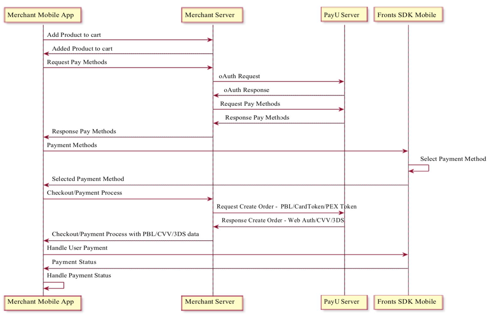

PayU SDK Lite is created for more advanced merchants and consist 
of components that could be used **almost independent**:


#### Core
- `PUVisualStyle`
- `PUCardVisualStyle`
- `PUInputVisualStyle`
- `PUButtonVisualStyle`
- `PUVisualStyleElement`

#### About screen:
- `PUAboutViewController`

#### WebPayments:
This module supports Pay By Links, 3DS and PEX (PayU Express) payments which require redirect user to web page to authorize this payment process. (module is implemented with iOS WKWebView):  https://developer.apple.com/documentation/webkit/wkwebview
- `PUWebAuthorizationViewController`
- `PUWebAuthorizationBuilder`

#### CVVAuthoriation:
- `PUCVVAuthorizationHandler`
- `PUCVVAuthorizationResult`

#### PaymentMethods & PaymentWidget:
- `PUPaymentMethodListViewController`
- `PUPaymentWidgetService`

#### AddCard:
This module adding/removing card for user on PayU backend. Adding card means collect all required data from user and convert (with usage of PayU backend) to card token which can be used to trigger payment process
- `PUAddCardService`
- `PUAddCardViewController`

## Technical details
PayU SDK Lite is provieded as iOS Framework (fat/Universal - which can be used either on physical device or simulator). Due to compatibility reasons framework is written in Objective-C but without any changes can be integrated into Swift based app.

## Supported platforms and languages
With the PayU SDK Lite for iOS, you can build apps that target native devices running iOS 10.0 and later. Developing an application with the PayU SDK Lite for iOS requires at least Xcode 9.0.
Supported languages: English, Polish, German, Czech, Hungarian

## Integration
To add the PayU Lite iOS SDK to your Xcode project you have to:
- extract downloaded package in your local file system
- add the PayU_SDK_Lite.framework to your Xcode project:
	- click on your app target and choose the "General" tab
    - find the section called "Embedded Binaries", click the plus (+) sign, and then click the "Add Other" button
    	- from the file dialog box, select the "PayU_SDK_Lite.framework" folder (ensure that the "Copy items if needed" and "Create folder reference" options are selected)
	- click Finish
- ensure (see next image) that PayU_SDK_Lite.framework appears in the "Embedded Binaries" and the "Linked Frameworks and Libraries" sections


Note: this SDK version allows merchant to debug with XCode app during development process.

## Core

#### PUVisualStyle

Each module can be configured to utilize defined by merchants colors and other properties.
`PUVisualStyle` objects are used to visually style PayU-SDK UI components.
```objc
@property (strong, nonatomic) UIColor *primaryBackgroundColor;
@property (strong, nonatomic) UIColor *accentColor; // primary accent color for module
@property (strong, nonatomic) UIColor *navigationBarTintColor; // value to set for `navigationBar.barTintColor`

@property (strong, nonatomic) PUCardVisualStyle *cardVisualStyleEnabled; // `cardVisualStyleEnabled` is used for `enabled` card-styled cells (`PUPaymentMethodListViewController`, etc.)
@property (strong, nonatomic) PUCardVisualStyle *cardVisualStyleDisabled; // `cardVisualStyleDisabled` is used for `disabled` card-styled cells (`PUPaymentMethodListViewController`, etc.)

@property (strong, nonatomic) PUInputVisualStyle *inputVisualStyle; // `inputVisualStyle` is used to style input view, such as: card number input, cvv input, etc.

@property (strong, nonatomic) PUButtonVisualStyle *primaryButtonStyle; // 'primaryButtonStyle' is used for primary buttons, such as: 'Save an use' button in card create flow, etc.
@property (strong, nonatomic) PUButtonVisualStyle *basicButtonStyle; // 'basicButtonStyle' is used for basic buttons, such as: 'Use' button in card create flow, etc.
@property (strong, nonatomic) PUButtonVisualStyle *inactiveButtonStyle; // 'inactiveButtonStyle' is used for inactive buttons

@property (strong, nonatomic) PUVisualStyleElement *secondaryHeadingStyle; // secondary heading text style used for ex. in `PUAddCardService` module
@property (strong, nonatomic) PUVisualStyleElement *primaryTextStyle; // primary text style used for ex. in `PUAboutViewController`
@property (strong, nonatomic) PUVisualStyleElement *secondaryTextStyle;  // secondary text style used for ex. in `PUAboutViewController`

/**
 This property is used to set the `titleView` for `navigationBar` for viewControllers where it is available (for ex. 'PUPaymentMethodListViewController').
 To use custom logo, provide instance of `PUBrandImageProvider` class. Loaded image should be placed in UIImageView with size CGSizeMake(70, 35)
 By default, it should show `PayU` logo.
*/
@property (strong, nonatomic) PUBrandImageProvider* logoImageProvider;

+ (instancetype)defaultStyle;
```

#### Dark Mode Support
Dafault style of `PUVisualStyle` supports Dark Mode. It should automaticaly apply when device `traitCollection` change.
If you want to create your own visual style, or to change `UIColor` value of any of existing styles, please keep in mind to use colors with dynamic provider based on `userInterfaceStyle`. 
```objc
UIColor* awesomeColor = [UIColor colorWithDynamicProvider:^UIColor * _Nonnull(UITraitCollection * _Nonnull traitCollection) {
            switch (traitCollection.userInterfaceStyle) {
                case UIUserInterfaceStyleDark:
                    return [UIColor redColor];
                default:
                    return [UIColor yellowColor];
            }
        }];
PUCardVisualStyle* awesomeCardVisualStyle = [PUCardVisualStyle preferredCardVisualStyleEnabled];
awesomeCardVisualStyle.backgroundColor = awesomeColor;
```

#### PUCardVisualStyle
Class to define visual style for cells. Used for ex. in `PUPaymentMethodListViewController`
```objc
@property (strong, nonatomic) UIColor* backgroundColor;
@property (strong, nonatomic) UIColor* titleTextColor;
@property (strong, nonatomic) UIColor* subtitleTextColor;
@property (assign, nonatomic) CGFloat borderCornerRadius;
@property (strong, nonatomic) UIColor* borderColor;
@property (assign, nonatomic) CGFloat borderWidth;

/**
 Initializes an `PUCardVisualStyle` object with default parameters for `enabled` state.
 @return The newly-initialized PUCardVisualStyle instance
*/
+ (instancetype) preferredCardVisualStyleEnabled;

/**
 Initializes an `PUCardVisualStyle` object with default parameters for `disabled` state.
 @return The newly-initialized PUCardVisualStyle instance
*/
+ (instancetype) preferredCardVisualStyleDisabled;
```

#### PUInputVisualStyle
Class to define visual style for inputView (textField). Used for ex. in `PUAddCardService`
```objc
@property (strong, nonatomic) UIColor* inputTextColor;
@property (strong, nonatomic) UIFont* inputTextFont;
@property (strong, nonatomic) UIColor* inputBackgroundColor;
@property (strong, nonatomic) UIColor* inputBorderColor;
@property (assign, nonatomic) CGFloat inputBorderWidth;
@property (assign, nonatomic) CGFloat inputCornerRadius;
@property (strong, nonatomic) UIColor* inputBottomTextColor;
@property (strong, nonatomic) UIFont* inputBottomTextFont;
@property (assign, nonatomic) UIEdgeInsets contentInsets;
@property (assign, nonatomic) CGFloat height;

/**
 Initializes an `PUInputVisualStyle` object with default parameters
 @return The newly-initialized PUInputVisualStyle instance
*/
+ (instancetype) preferredInputVisualStyle;
```

#### PUButtonVisualStyle
Class to define visual style for buttons. Used for ex. in `PUAddCardService`
```objc
@property (strong, nonatomic) UIColor* buttonBorderColor;
@property (assign, nonatomic) CGFloat buttonBorderWidth;
@property (assign, nonatomic) CGFloat buttonCornerRadius;
@property (strong, nonatomic) UIColor* buttonBackgroundColor;
@property (assign, nonatomic) UIEdgeInsets buttonContentInsets;
@property (strong, nonatomic) UIFont* buttonTextFont;
@property (strong, nonatomic) UIColor* buttonTextColor;
@property (assign, nonatomic) CGFloat buttonHeight;

/**
 Initializes an `PUButtonVisualStyle` object with default parameters for `primary` style.
 @return The newly-initialized PUButtonVisualStyle instance
*/
+ (instancetype) preferredPrimaryButtonVisualStyle;

/**
 Initializes an `PUButtonVisualStyle` object with default parameters for `basic` style.
 @return The newly-initialized PUButtonVisualStyle instance
*/
+ (instancetype) preferredBasicButtonVisualStyle;

/**
 Initializes an `PUButtonVisualStyle` object with default parameters for `inactive` style.
 @return The newly-initialized PUButtonVisualStyle instance
*/
+ (instancetype) preferredInactiveButtonVisualStyle;
```

## About screen
This screen presents additional information about payment SDKto end user. It's available from for example: `PaymentMethods` & `PaymentWidget` but can be also presented by Merchant by itself (with different UI style):
```objc
PUVisualStyle *uiStyle = [PUVisualStyle defaultStyle]; 
PUAboutViewController *aboutViewController = [PUAboutViewController aboutViewControllerWithVisualStyle:uiStyle];
```
| Light | Dark |
| ----------- | ----------- |
| 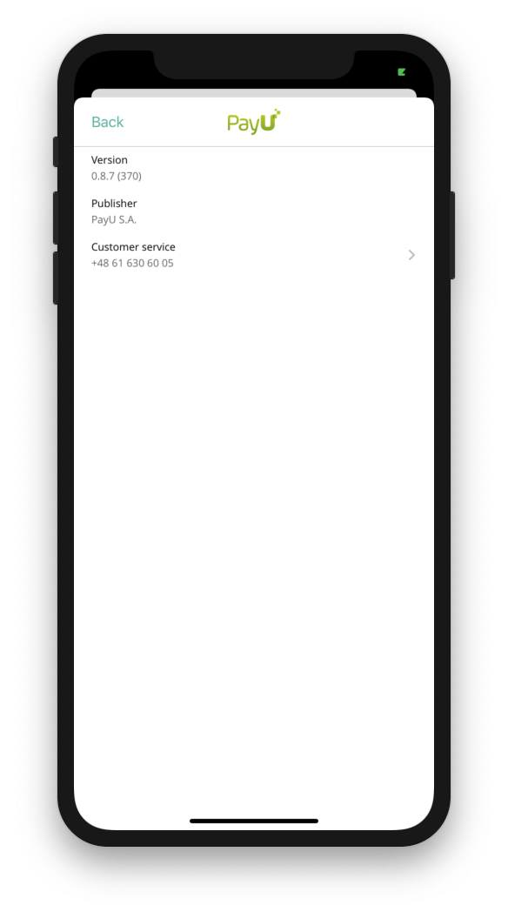 |  |


## WebPayments

#### Introduction
Main purpose in using this module is to help end user successfully process Pay By Links, PEX and 3DS payments. This doesn't mean that the cash was transferred from user to merchant - this needs additional time to process (merchant needs to check it between BackendPayU and BackendMerchant).
- Pay By Link is a type of payment when user needs to use browser to pay for the purchased products
- PEX (PayU Express) is a type of payment that is usually approved without additional user authorization, however certain transactions (of high value, high frequency, etc) can have additional web authorization, similar to Pay By Links.
- 3DS (3-D Secure: https://en.wikipedia.org/wiki/3-D_Secure) is a type of payment when user needs to use browser to authorize card payment

Sample use case for WebPayments module - handling PBL payment:
- Checkout/Payment Process - user select pay with PBL (login to specific bank and pay)
- Checkout/Payment Process - at the end of local check out request is send to merchant backend to create an order on PayU side
- Checkout/Payment Process - Response from created order is passed from merchant backend to PayU SDK Lite (via mobile app) Handle User 
- Payment - WebPayments module check if user paid for shopping using selected bank
- Payment Status - status code is passed to merchant's mobile app

This module contains objects:
- `PUWebAuthorizationViewController` - presents for user PayByLink process and handle whole interaction
- `PUWebAuthorizationBuilder` - creates `PUWebAuthorizationViewController` with provided request and UI style.
	```objc
	- (PUWebAuthorizationViewController *)viewControllerForPayByLinkAuthorizationRequest:(PUPayByLinkAuthorizationRequest *)request
	                                                                         visualStyle:(PUVisualStyle *)style;
	
	- (PUWebAuthorizationViewController *)viewControllerFor3dsAuthorizationRequest:(PU3dsAuthorizationRequest *)request
	                                                                   visualStyle:(PUVisualStyle *)style;
	
	- (PUWebAuthorizationViewController *)viewControllerForPexAuthorizationRequest:(PUPexAuthorizationRequest *)request
	                                                                   visualStyle:(PUVisualStyle *)style);
	```
- `PUPayByLinkAuthorizationRequest` - represents PayByLink request with order IDs, redirect URIs - all expected fields are initialized by designated initializer:
	```objc
	- (instancetype)initWithOrderId:(NSString *)orderId
	                     extOrderId:(NSString *)extOrderId
	                    redirectUri:(NSURL *)redirectUri
	                    continueUrl:(NSURL *)continueUrl;
		// continueUrl needed for PAY_BY_LINK payments, this URL could be obtained 
        	// from `OrderCreateResponse` or it is a shop page that was verfied by PayU Administrators.                    
	```
- `PUAuthorizationDelegate` - protocol to be implemented by `PUWebAuthorizationViewController` delegate to receive payment status.
	```objc
	@protocol PUAuthorizationDelegate
	- (void)authorizationRequest:(id<PUAuthorizationRequest>)request
	         didFinishWithResult:(PUAuthorizationResult)result
	                    userInfo:(nullable NSDictionary*)userInfo;
	@end
	```
- `PUAuthorizationResult` - webPayment method status with possible values:
	- `PUAuthorizationResultSuccess` - `userInfo` should be empty
	- `PUAuthorizationResultContinueCVV` - `userInfo` should contain `refReqId` value for key `PUAuthorizationResultRefReqIdUserInfoKey`. After you receive this result, there is needed an additional action to authorize CVV via `PUCVVAuthorizationHandler`
	- `PUAuthorizationResultFailure` - `userInfo` should contain detailed NSError value for key `PUAuthorizationResultErrorUserInfoKey`
	```objc
	typedef NS_ENUM(NSInteger, PUAuthorizationResult) {
	    PUAuthorizationResultSuccess,
	    PUAuthorizationResultFailure,
	    PUAuthorizationResultContinueCvv
	};
	```
 To use WebPayment method module (PayByLink) you have to:
 - Initial condition - create order on PayU backend with PayByLink or 3DS payment (documentation link: https://payu21.docs.apiary.io/#reference/api-endpoints/order-api-endpoint/create-a-new-order)
 - create `PUPayByLinkAuthorizationRequest` and fill all necessary fields (the only required field is redirectUri, all others optional and can be used by merchant when authorization result receive)
 - create `PUWebAuthorizationViewController` with help of `PUWebAuthorizationBuilder` (`PUVisualStyle` injected)
	```objc
    PUVisualStyle *uiStyle = [PUVisualStyle defaultStyle]; 
    PUPayByLinkAuthorizationRequest *request = [[PUPayByLinkAuthorizationRequest alloc] 
						   initWithOrderId:@"orderID" 
							extOrderId:@"externalOrderID" 
						       redirectUri:[NSURL URLWithString:@"redirectURIString"] 
						       continueUrl:[NSURL URLWithString:@"continueURLString"]]; 
	PUWebAuthorizationViewController *webAuthorizationViewController = [[PUWebAuthorizationBuilder alloc] viewControllerForPayByLinkAuthorizationRequest:request visualStyle:uiStyle];
	```
- implement `PUAuthorizationDelegate`
	```objc
	webAuthorizationViewController.delegate = self;
	UINavigationController *navigationController = [[UINavigationController alloc] 		
				initWithRootViewController:webAuthorizationViewController];
	[navigationController presentViewController:navigation animated:YES completion:nil];
	```
| Light | Dark |
| ----------- | ----------- |
| 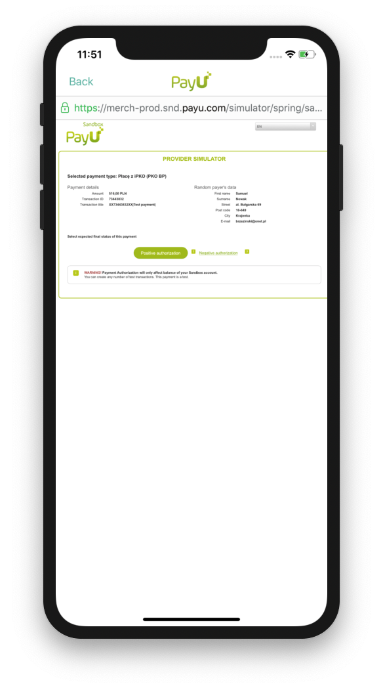 | 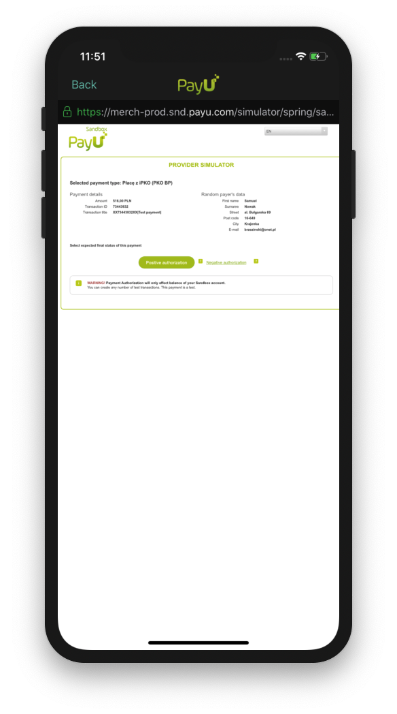 |

To use WebPayment method module with 3DS you have to change (in above example):
```objc
PUPexAuthorizationRequest *request = [[PUPexAuthorizationRequest alloc] 
		initWithOrderId:@"orderID"
                     extOrderId:@"externalOrderID"
		    redirectUri:[NSURL URLWithString:@"redirectURIString"]
		    continueUrl:[NSURL URLWithString:@"continueURLString"]];
    
    PUWebAuthorizationViewController *webAuthorizationViewController = [[PUWebAuthorizationBuilder alloc]
                                                                        viewControllerForPexAuthorizationRequest:request
                                                                        visualStyle:style];
```

To use WebPayment method module with PEX you have to change (in above example):
```objc
PUPexAuthorizationRequest *request = [PUPexAuthorizationRequest alloc] 
		initWithOrderId:@"orderID"
		     extOrderId:@"externalOrderID"
                    redirectUri:[NSURL URLWithString:@"redirectURIString"] 
		    continueUrl:[NSURL URLWithString:@"continueURLString"]];
PUWebAuthorizationViewController *webAuthorizationViewController = [[PUWebAuthorizationBuilder alloc] viewControllerForPexAuthorizationRequest:request visualStyle:uiStyle];
```

## PaymentMethods & PaymentWidget

#### Introduction
PaymentMethod & PaymentWidget module are the components that help merchant with presenting and retrieving selected Payment Method by the end user. Currently mobile solution will support only Card Payments (Visa, Maestro, Mastercard) and simple PayByLinks (Apple Pay are not supported) This component is integrated with AddCard module so in addition to selecting payment method, user can add manually a card to PayU backend (can also remove card from PayU backend - this requires additional action on merchant side).

Sample use case for PaymentMethod & PaymentWidget module:
- Request Pay Methods - obtaining payment methods from PayU backend and pass it to library
- Select Payment Method - end user will see PaymentWidget and when pressing it PaymentMethod module will propse payment methods
- Select Payment Method - end user will select payment method Select
- Payment Method - return to mobile/local checkout

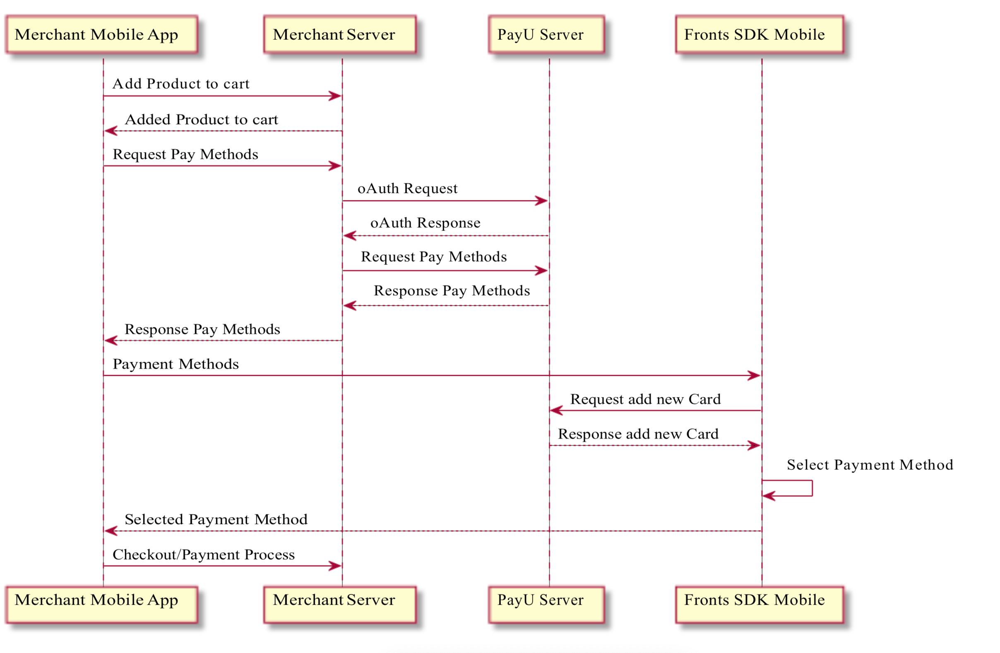

This module contains objects:
- `PUPaymentMethodParser` - default json parser for payment methods. Data parsed by this parser should be fetch from the paymethods API endpoint. Available error codes are: `PUPaymentMethodParserMissingKeyErrorCode`, `PUPaymentMethodParserInvalidStatusErrorCode`.
	```objc
	- (PUPayByLink *)parsePayByLinkMethodFromJSONData:(NSData *)data error:(NSError **)error;
	- (PUCardToken *)parseCardTokenMethodFromJSONData:(NSData *)data error:(NSError **)error;
	- (PUPexToken *)parsePexTokenMethodFromJSONData:(NSData *)data error:(NSError **)error;
	- (PUBlikToken *)parseBlikTokenMethodFromJSONData:(NSData *)data error:(NSError **)error;
	```
- `PUPaymentWidgetService` - provides PaymentWidget for merchant and handle whole interaction
- `PUPaymentWidgetServiceDelegate`- protocol to be implemented by PUPaymentWidgetService delegate to receive payment method select status
	```objc
    @protocol PUPaymentWidgetServiceDelegate
	- (void)paymentWidgetService:(PUPaymentWidgetService *)paymentWidgetService didSelectCardToken:(PUCardToken *)cardToken;
	- (void)paymentWidgetService:(PUPaymentWidgetService *)paymentWidgetService didSelectPayByLink:(PUPayByLink *)payByLink;
	- (void)paymentWidgetService:(PUPaymentWidgetService *)paymentWidgetService didSelectApplePay:(PUApplePay *)applePay;
	- (void)paymentWidgetService:(PUPaymentWidgetService *)paymentWidgetService didSelectBlikCode:(PUBlikCode *)blikCode;
	- (void)paymentWidgetService:(PUPaymentWidgetService *)paymentWidgetService didSelectBlikToken:(PUBlikToken *)blikToken;
	- (void)paymentWidgetService:(PUPaymentWidgetService *)paymentWidgetService didSelectPexToken:(PUPexToken *)pexToken;
	- (void)paymentWidgetServiceDidDeselectPaymentMethod:(PUPaymentWidgetService *)paymentWidgetService;
	- (void)paymentWidgetService:(PUPaymentWidgetService *)paymentWidgetService didDeleteCardToken:(PUCardToken *)cardToken;
	- (void)paymentWidgetService:(PUPaymentWidgetService *)paymentWidgetService didDeletePexToken:(PUPexToken *)pexToken;
	@end
    ```
- `PUPaymentWidget` - `UIView` for `PUPaymentWidget`
- `PUPaymentMethodsConfiguration` - configuration object.
	```objc
    @interface PUPaymentMethodsConfiguration : NSObject
	@property (copy, nonatomic) NSString *posID; // Describes MerchantID
	@property (nonatomic) PUEnvironment environment; // Describes which environment should be used for network calls
	@property (copy, nonatomic) NSArray <PUCardToken *> *cardTokens; // CardTokens retrived for user from PayU backend
	@property (copy, nonatomic) NSArray <PUBlikToken *> *blikTokens; // BlikTokens retrived for user from PayU backend
	@property (copy, nonatomic) NSArray <PUPayByLink *> *payByLinks; // PayByLinks retrived for user from PayU backend
	@property (copy, nonatomic) NSArray <PUPexToken *> *pexTokens; // PEX Tokens retrived for user from PayU backend
	@property (nonatomic) BOOL showAddCard; // Describes whether Add Card action should be presented in PaymentMethodListViewController
	@property (nonatomic) BOOL showPayByLinks; // Describes whether Bank Transfer action should be presented in PaymentMethodListViewController
	@property (nonatomic) BOOL isBlikEnabled; // Describes whether BLIK payment method should be available. Requires POS with configured BLIK payment method.
	@property (nullable, strong, nonatomic) PUBrandImageProvider* cardBrandImageProvider; // Custom image for 'Card' method payment in `PUPaymentMethodListViewController`
	@property (nullable, strong, nonatomic) PUBrandImageProvider* bankBrandImageProvider; // Custom image for 'Bank' method payment in `PUPaymentMethodListViewController`
	@end
    ```
    
To use `PUAddCardService` you have to:
- create `PUPaymentWidgetService`
	```objc
    PUPaymentWidgetService *paymentWidgetService = [[PUPaymentWidgetService alloc] init];
    ```
- create and fill `PUPaymentMethodsConfiguration`
	```objc
    PUPaymentMethodsConfiguration *configuration = [[PUPaymentMethodsConfiguration alloc] init]; 
    configuration.posId = @"posID_merchantID";
    configuration.environment = PUEnvironmentSandbox; // or PUEnvironmentProduction for production 
    configuration.cardTokens = received_cardTokens; // assign parsed cardToken objects received from PayU backend
    configuration.pexTokens = received_pexTokens; // assign parsed pexToken objects received from PayU backend 
    configuration.payByLinks = received_payByLinks; // assign parsed payByLink objects received from PayU backend
    configuration.showAddCard = YES; // or NO if end user shouldn't have possibility to add new card
    ```
 - implement & set `PUPaymentWidgetServiceDelegate`
	```objc
	paymentWidgetService.delegate = self;
    ```
- grab `PUPaymentWidget` from `PUPaymentWidgetService` and present it to end user according to your strategy
	```objc
	PUPaymentWidget *paymentWidget = [paymentWidgetService getWidgetWithStyle:uiStyle configuration:configuration];
    ```
- during the lifetime of `PUPaymentWidgetService` you still can update configuration attached to it without need to recreat whole object
	```objc
	PUPaymentMethodsConfiguration *newConfiguration = [[PUPaymentMethodsConfiguration alloc] init];
	// ... update all needed fields ...
	[paymentWidgetService updateWithConfiguration:newConfiguration];
    ```
- and you can also clear all cache (provided payment methods (pbls, cards & pex) and selected payment method) for `PUPaymentWidgetService`
	```objc
	[paymentWidgetService clearCache]
    ```

#### Note
When user trigger delete action for card token or PEX token payment method this will callback to merchant with
```objc
- (void)paymentWidgetService:(PUPaymentWidgetService *)paymentWidgetService didDeleteCardToken:(PUCardToken *)cardToken;
- (void)paymentWidgetService:(PUPaymentWidgetService *)paymentWidgetService didDeletePexToken:(PUPexToken *)pexToken;
```
which should be handle on PayU backend according to documentation: https://payu21.docs.apiary.io/#introduction/integration-flow

|  |  |  |  |
| ----------- | ----------- | ----------- | ----------- |
||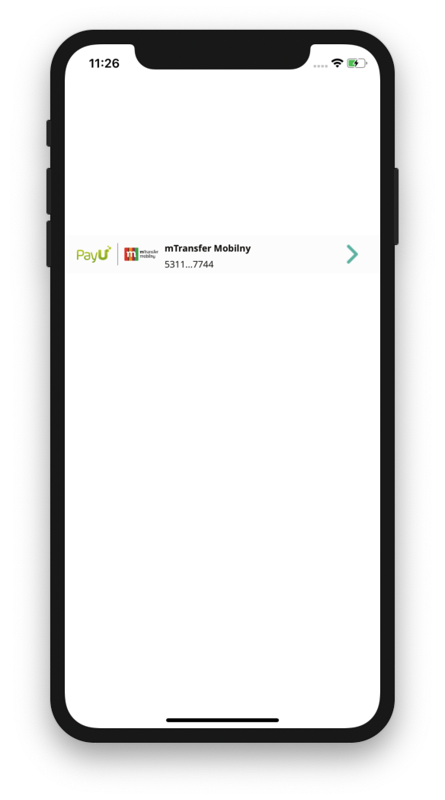|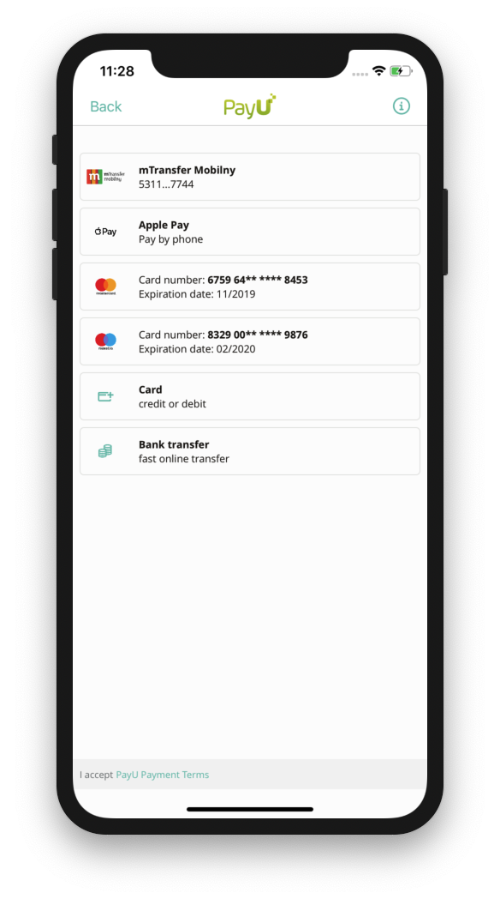|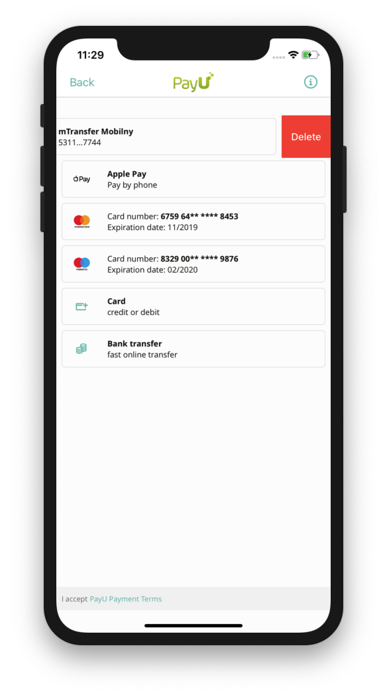|

## AddCard

#### Introduction
AddCard module is used to add new payment card by the user to PayU endpoint. Sample use case for using AddCard module:
- Add Card - Open Merchant View with AddCard module
- Request add new Card - Tokenize sended card on PayU backend
- Request add new Card/Return Card token - Send token to merchant mobile App


Embedding AddCard form on screen is on merchant side.

This module contains objects:
- `PUAddCardService` - provides AddCard form for merchant and handle whole interaction. Requires from merchant to provide buttons to trigger action
	- Use - this action will use card one (create one time token) - will not store this card in PayU backend
	- Save & Use - this action will save (after 1st correct payment) card on PayU backend (card will be available in retreive payment methods)
- `PUAddCardViewController` - presents for user all screen AddCard form and handle whole interaction.
- `PUAddCardViewControllerDelegate` - protocol to be implemented by `PUAddCardViewController` delegate to receive add card status.
	```objc
	@protocol PUAddCardViewControllerDelegate
    - (void)addCardViewController:(PUAddCardViewController *)viewController didAddCardWithCardToken:(PUCardToken *)cardToken;
    - (void)addCardViewController:(PUAddCardViewController *)viewController didFailToAddCardWithError:(NSError *)error;
    @end
	```

#### PUAddCardService
To use `PUAddCardService` you have to:
- create `PUAddCardService`
	```objc
	PUAddCardService *addCardService = [[PUAddCardService alloc] init];
    ```
- grab AddCardWidget from PUAddCardService and layout it in parent view
	```objc
	PUVisualStyle *uiStyle = [PUVisualStyle defaultStyle];
	UIView *addCardWidget = [addCardService addCardViewWithStyle:uiStyle]; 
    // add addCardWidget to parent view & layout
    ```
- add action buttons with action triggering
	```objc
	- (void)addCardAndSave:(BOOL)save
    	             posID:(NSString *)posID
	           environment:(PUEnvironment)environment
    	           success:(PUAddCardSuccesAction)successAction
        	       failure:(PUAddCardFailureAction)failureAction;
    ```
- present View/ViewController to user according to your strategy

| Light | Dark |
| ----------- | ----------- |
|  |  |

#### PUAddCardViewController
This module can be used when merchant doesn't want to apply custom branding for add card form and still want to be able to provide user possibility to add new card for payment. `PUAddCardViewController` is presented by SDK for add card action from PaymentMethod List

To use `PUAddCardViewController` you have to:
- create `PUAddCardViewController`
	```objc
	PUVisualStyle *uiStyle = [PUVisualStyle defaultStyle]; 
    PUAddCardViewController *addCardViewController = [PUAddCardViewController addCardViewControllerWithVisualStyle:uiStyle merchantID:@"merchantID"];
    ```
- implement & set `PUAddCardViewControllerDelegate`
	```objc
	addCardViewController.addCardDelegate = self;
    ```
- present `PUAddCardViewController`
	```objc
	UINavigationController *navigationController = [[UINavigationController alloc] initWithRootViewController:addCardViewController];
    [navigationController presentViewController:navigation animated:YES completion:nil];
    ```

| Light | Dark |
| ----------- | ----------- |
|  | 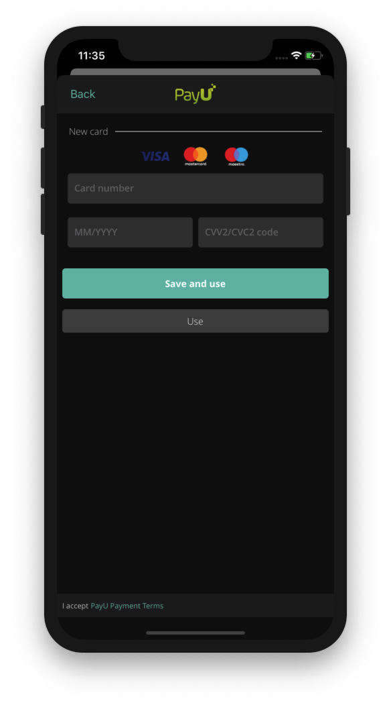 |

> NOTE: AddCard functionality implements SSL certificate pinning. Listening to network traffic using an untrusted certificate will end with `NSURLErrorCancelled` (-999).

## CVV Authorization

#### Introduction
CVVAuthorization module is used to authorize card payment with CVV code (provided by user) and is used when PayU backend requires this action on user side:
- card payment with CVV authorization
- card payment with 3DS authorization which requires additionally to be authorized with card CVV 

This module contains objects:
- `PUCVVAuthorizationHandler` - Provides form to user & handles authorization process on backend side.
- `PUCVVAuthorizationResult` - CVV Authorization status with possible values:
	```objc
	typedef NS_ENUM(NSInteger, PUCVVAuthorizationResult) { 
    	PUCVVAuthorizationStatusCanceled = 0, 
        PUCVVAuthorizationStatusFailure, 
        PUCVVAuthorizationStatusSuccess
	};
    ```
To use PUCVVAuthorizationHandler you have to: 
- create `PUCVVAuthorizationHandler` 
	```objc
	PUVisualStyle *uiStyle = [PUVisualStyle defaultStyle];
	PUCVVAuthorizationHandler *cvvAuthorizationHandler = [[PUCVVAuthorizationHandler alloc] initWithVisualStyle:uiStyle 
    																								   UIparent:parentViewController 
                                                                                                    environment:PUEnvironmentSandbox];
    ```
- trigger authorization process
	```objc
	[cvvAuthorizationHandler authorizeRefReqID:@"refReqID_received_from_PayUBackend" status:^(PUCVVAuthorizationResult authorizationResult) {
		// implement authorization status change here
	}];
    ```
| Light | Dark |
| ----------- | ----------- |
|  |  |

## New BLIK payments

#### Introduction
At start there is an possibility to use BLIK as PBL payment method. From user perspective steps looks like:
- Press on Widget
- Press on Bank Transfer button
- Select "BLIK"
- Payment process will be handled by WebView container with redirection system.

#### New Blik
This payment will differ from previous BLIK payment. To unlock new payment type please contact with PayU Support or your contact on PayU site to configure POS for BLIK 2.0.

| Light | Dark |
| ----------- | ----------- |
| 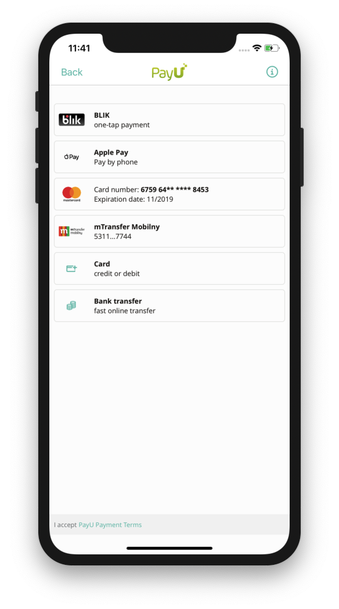 | 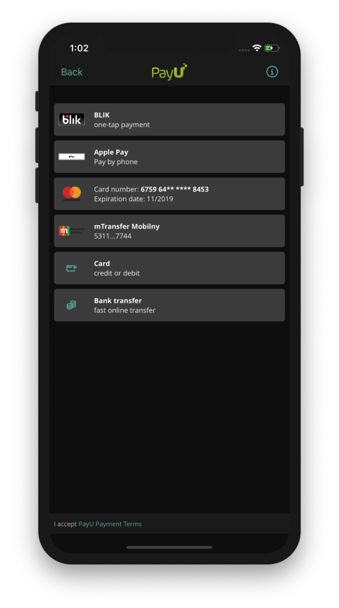 |

#### Setup on Mobile
To turn on new BLIK please set the new flag in `PUPaymentMethodsConfiguration` object:
```objc
PUPaymentMethodsConfiguration *config = [PUPaymentMethodsConfiguration new]; 
config.isBlikEnabled = YES; // Default value for this property is NO.
```

In case when user didn't retrieve saved BLIK payment method, library will add one generic "BLIK" (called `PUBlikCode`) item that will be seen above card payment method. After selecting generic BLIK payment user will need to input 6 digit value from bank application. On the other hand, when retrieved payment methods return BLIK payment method (called `PUBlikToken`), user don't need to input 6 digit value as it is not mandatory.
All BLIK tokens passed to configuration will appear in the payment methods list. When given array of BLIK tokens is nil, empty, or is not set, BLIK code item will appear in the list.
```objc
config.blikTokens = @[[[PUBlikToken alloc]
     initWithValue:@"retreivedTokenValue"
     brandImageProvider:brandImageProvider
     type:@"retreivedTokenType" 
     isEnabled:YES]];
```
`PUBlikCode` is a Payment when user does not store any BLIK payments in PayU environment so in this case user is required to input 6 digit code.
| Light | Dark |
| ----------- | ----------- |
|  |  |

Handling generic BLIK CODE and BLIK TOKEN payments selection:
```objc
@interface ViewController () <PUPaymentWidgetServiceDelegate> @end
@implementation ViewController
- (void) paymentWidgetService:(PUPaymentWidgetService *)paymentWidgetService didSelectBlikCode:(PUBlikCode *)blikCode {
	// handle selection here
}
- (void) paymentWidgetService:(PUPaymentWidgetService *)paymentWidgetService didSelectBlikToken:(PUBlikToken *)blikToken { 
	// handle selection here
}
@end
```
Widget automatically validates user input. It does not allow to enter non-digit characters. Characters count must equal 6. If these conditions are not satisfied, `blikAuthorizationCode` will return nil.
```objc
if (paymentWidgetService.isBlikAuthorizationCodeRequired) { 
	NSString *code = paymentWidgetService.blikAuthorizationCode;
    // use code here
}
```
#### Handling more than one BLIK - Ambiguity
In case when user select BLIK as payment and create an OCR with it, PayU backend can return `AUTH_TOKEN_NONUNIQUE`. This status code inform that the end user has more than one BLIK token saved in bank and merchant should check blikData params and present possible BLIK payments to user.

In order to present possible BLIK payments, merchant can instantiate a `PUBlikAlternativesViewController` object and present it to the user. This view controller expects to receive a list of `PUBlikAlternative` objects created with data given in blikData response fields.
```objc
NSArray<PUBlikAlternative *> *itemsList = @[[[PUBlikAlternative alloc] initWithAppLabel:appLabel1 appKey:appLKey1],
                                            [[PUBlikAlternative alloc] initWithAppLabel:appLabel2 appKey:appLKey2]];

PUBlikAlternativesViewController *blikAlternativesVC = [PUBlikAlternativesViewController
                                                        blikAlternativesViewControllerWithItemsList:itemsList
                                                        visualStyle:visualStyle];

blikAlternativesVC.delegate = self
UINavigationController *navigationVC = [[UINavigationController alloc] initWithRootViewController:blikAlternativesVC];
navigationVC.modalPresentationStyle = UIModalPresentationCurrentContext;
[self presentViewController:navigationVC animated:true completion:nil];
```

| Light | Dark |
| ----------- | ----------- |
| 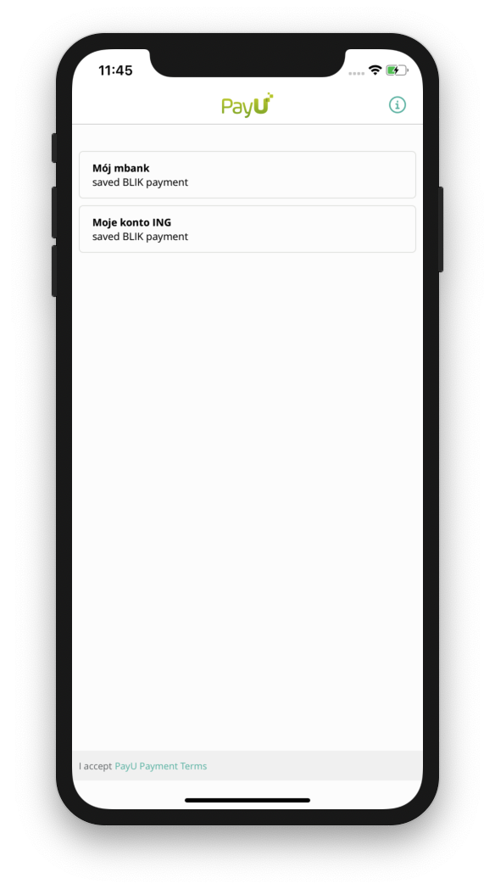 | 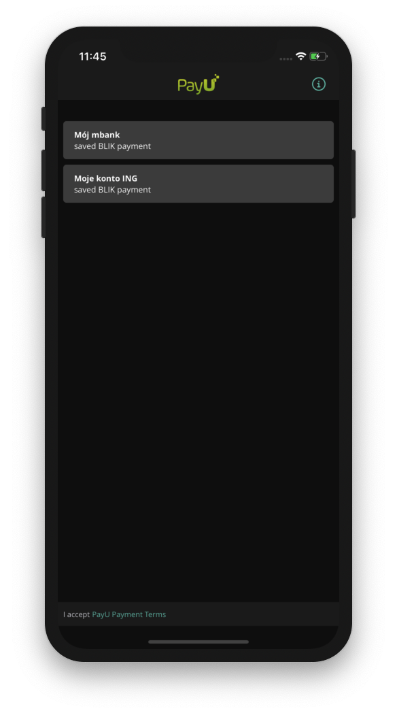 |

Handling BLIK ALTERNATIVE selection:
```objc
@interface ViewController () <PUBlikAlternativesViewControllerDelegate>
@end

@implementation ViewController
- (void) blikAlternativesViewController:(PUBlikAlternativesViewController *)blikAlternativesViewController
               didSelectBlikAlternative:(PUBlikAlternative *)blikAlternative {
    // handle selection here
}
@end
```

## PUFooterView
> Note: Footer view desn't support customization (there is no possibility to apply PUVisualStyle)

This module can be used when merchant whant to add terms & conditions footer to other views in app. Texts and action are handle by `PUFooterView` (documents content provided by PayU). Texts in footer are translated by PayU SDK.
```objc
@interface PUFooterView : UIView
@property (weak, nonatomic) UIViewController *UIParent;
+ (instancetype)footerViewWithUIParent:(UIViewController *)UIParent
                           visualStyle: (PUVisualStyle*) visualStyle;
@end
```
Parameter/member UIParent is used as parent `ViewController` for `ViewController` used to load terms & condition document. To use `PUFooterView` you have to grab `PUFooterView` and present it to end user according to your strategy
```objc
PUFooterView *footerView = [PUFooterView footerViewWithUIParent:self];
```
| Light | Dark |
| ----------- | ----------- |
| 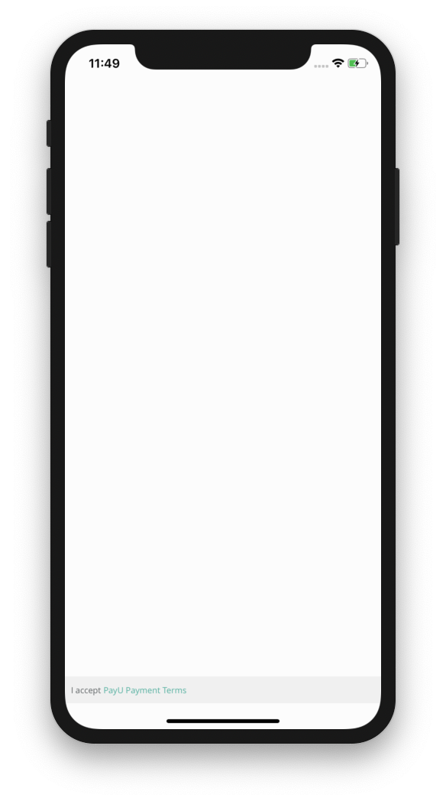 | 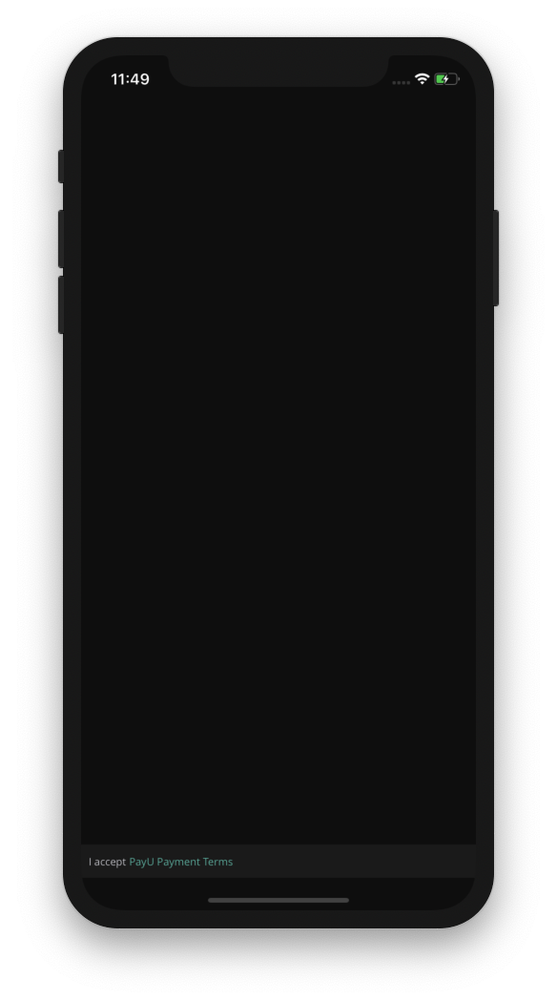 |
